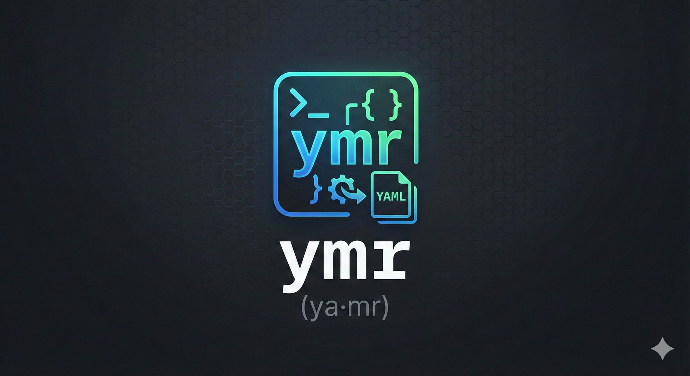

<a name="readme-top"></a>

<div align="center">


<br />

<p align="center">
<strong>ymr</strong> (pronounced <strong>ya·mr</strong>) is a lightweight, spec-driven command-line tool to generate YAML files from templates. It’s ideal for managing configuration across multiple environments or targets by replacing placeholders in your YAML templates with values defined in a central spec file.

<br />

<a href="https://github.com/lnrdll/ymr/issues/new?labels=bug&template=bug_report.md">Report Bug</a>
·
<a href="https://github.com/lnrdll/ymr/issues/new?labels=enhancement&template=feature_request.md">Request Feature</a>
</p>
</div>

---

**TOC**
- [Why?](#why)
- [How it Works](#how-it-works)
- [Agent Notes](#agent-notes)
- [Spec-less Mode](#spec-less-mode)
- [Installation](#installation)
- [Development](#development)
- [Usage](#usage)
- [Template Syntax](#template-syntax)
- [Examples](#examples)
- [Contributing](#contributing)
- [License](#license)

---

### Why?
<a name="why"></a>

Existing YAML templating tools — such as `jtt`, `Helm`, `Kustomize`, or `Kluctl` — are powerful and versatile, but they often come with a steep learning curve and impose specific formatting or structural requirements on your YAML files.

`ymr` takes a simpler, more flexible approach. You simply add comments to your existing YAML configuration, and if they match your defined specifications, `ymr` performs the substitutions keeping the integrity of the YAML file. This means you can use `ymr` with any YAML file, including those already managed by other tools, without modifying your current workflow or file structure, and use any YAML linter you want.

<p align="right">(<a href="#readme-top">back to top</a>)</p>

### How it Works
<a name="how-it-works"></a>

`ymr` processes YAML templates by substituting placeholders with values from your spec.yaml. It supports two main types of placeholders:

- `from-param: {{ .var }}` — replaces the entire value with the parameter `{{ .var }}`.
- `from-param-merge: {{ .var }}` — merges the parameter `{{ .var }}` into the existing YAML structure.

This allows for dynamic, reusable configuration generation — letting you define shared values once and selectively override them for specific environments or targets.

In addition, you can pipe the variables to the following functions:

- `lower`: to set all characters to lower case. Example: `from-param: {{ .var | lower }}`
- `upper`: to set all characters to upper case. Example: `from-param: {{ .var | upper }}`
- `replace`: to do string substitution. Example: `from-param: {{ .var | replace "." "-" }}`

Validations are also available if there is a need to enforce requirements. The policy engine uses the Common Expression Language ([CEL](https://cel.dev/)) and it validates every parameter passed.

<p align="right">(<a href="#readme-top">back to top</a>)</p>

### Agent Notes
<a name="agent-notes"></a>

If you're using `ymr` from an AI agent / coding assistant, read these first:

- `AGENTS.md`: repo map, architecture, invariants, and quick commands
- `SKILL.md`: agent-oriented usage rules and reliable invocation patterns

<p align="right">(<a href="#readme-top">back to top</a>)</p>

### Spec-less Mode
<a name="spec-less-mode"></a>

`ymr` can be run **without** a `--spec` (`-s`) flag (spec-less mode), which is useful for simple, one-off template rendering. In this mode, you must provide:

- A template file/URL via the `--template` (`-T`) flag.
- At least one parameter via the `--param` (`-p`) flag.

This mode is ideal for CI/CD pipelines or simple scripts where a full `spec.yaml` is unnecessary.

<p align="right">(<a href="#readme-top">back to top</a>)</p>

### Installation
<a name="installation"></a>

#### `go install`

You can install `ymr` using `go install`:
```bash
go install github.com/lnrdll/ymr@latest
```

#### `Mise`

You can install 'ymr' using `Mise`:
```bash
[tools]
"github:lnrdll/ymr" = "latest"
```

Alternatively, you can download the binary from the [releases page](https://github.com/lnrdll/ymr/releases).

#### Build from source

Build for your current platform:
```bash
mkdir -p dist
go build -trimpath -o dist/ymr .
```

Build release-style artifacts for linux/windows/darwin on amd64 and arm64:
```bash
bash scripts/build-all.sh
```

Artifacts are written to `dist/`.

<p align="right">(<a href="#readme-top">back to top</a>)</p>

### Development
<a name="development"></a>

Useful commands when working on `ymr` itself:

```bash
go test ./...

go build -trimpath -o dist/ymr .

# If you use mise (optional)
mise run test
mise run lint
```

Note: `mise` task definitions live in `mise.toml`.

<p align="right">(<a href="#readme-top">back to top</a>)</p>

### Usage
<a name="usage"></a>

`ymr` provides four commands: `init`, `run`, `validate`, and `version`.

#### `ymr init`

Generates a boilerplate `spec.yaml` file in your current directory. This is a great starting point for new projects.

```bash
ymr init
```

<details>
  <summary><strong>Example `spec.yaml` generated by `init`:</strong></summary>

```yaml
# A list of templates to process.
# Paths are relative to the location of this spec.yaml.
templates:
  - base/service.yaml
  - base/configmap.yaml

# A simple list of target environments.
targetIds:
  - dev
  - prd

# A list of parameter sets.
parameters:
  # --- Shared values ---
  - targetId: ["dev", "prd"] # Which targets this value set applies to
    values:
      name: "myapp-name"

  # --- Dev-specific values ---
  - targetId: ["dev"]
    values:
      minScale: 1

  # --- Prod-specific values ---
  - targetId: ["prd"]
    values:
      minScale: 3
      maxScale: 10
```

</details>

In addition to the default boilerplate, the `init` command also accepts parameters so the boilerplate can be customized.

```bash
ymr init --templates service.yaml --target dev --target stg -p 'maxScale: 10' -p 'minScale: 1'
```

<details>
  <summary><strong>Custom `spec.yaml` example:</strong></summary>

```yaml
# A list of templates to process.
# Paths are relative to the location of this spec.yaml.
templates:
  - service.yaml

# A simple list of target environments.
targetIds:
  - dev
  - stg

# A list of parameter sets.
parameters:
  # --- Shared values for all provided targets ---
  - targetId:
      - dev
      - stg
    values:
      maxScale: 10
      minScale: 1
  # --- Specific values for target 'dev' ---
  - targetId: ["dev"]
    values:
      foo: bar
  # --- Specific values for target 'stg' ---
  - targetId: ["stg"]
    values:
      foo: bar
```

</details>

#### `ymr run`

Processes templates based on a `spec.yaml` file and generates output files.

```bash
ymr run [flags]
```

**Flags:**

*   `-s`, `--spec <path>`: Source path for `spec.yaml` (local dir/file, http(s) URL, or GitHub). When omitted, `ymr` runs in spec-less mode.
*   `-T`, `--template <path>`: A single template file/URL to override the `templates` list in the spec.
*   `-o`, `--output <directory>`: Output directory for rendered files. Use `-` for stdout.
*   `-p`, `--param <key=value>`: Override a parameter (e.g., `key=value`). Can be used multiple times.
*   `-t`, `--target <id>`: Override which targets to render. Can be used multiple times.
*   `--token <token>`: GitHub token for accessing private repositories (or use `GITHUB_TOKEN` environment variable).
*   `--validation <path>`: Path to a policy file. If provided, this will override any validations in the spec file.
*   `--strict`: Fail the run if any template/target render step errors. By default, `ymr` runs in best-effort mode and skips failed templates/targets.
*   `--debug`: Enable debug logging.

**Example `ymr run` usage:**

```bash
# Spec-less mode
ymr run --template ./example/gcp-cloud-run/service.yaml -p version=111 -o -

# Strict mode (fail on any render error)
ymr run -s example/k8s --strict -o -

# Process spec.yaml and output to the 'rendered' directory
ymr run -s spec.yaml -o rendered

# Override a parameter for a specific run
ymr run -s example/gcp-cloud-run -p minScale=5 -o -

# Render only the 'prd' target
ymr run -s example/gcp-cloud-run -t prd -o -

# Use a GitHub repo directly (requires --token or GITHUB_TOKEN env for private repos)
ymr run -s https://github.com/lnrdll/ymr/example/k8s@main -o -

# Run in spec-less mode
ymr run -T https://github.com/lnrdll/ymr/blob/main/example/k8s/deployment.yaml -t dev -p name=example -o -

# Run in spec-less strict mode
ymr run -T ./example/k8s/deployment.yaml -t dev -p name=example --strict -o -
```

Note: In spec-less mode, if you write to files (i.e. `-o rendered/`), you typically want to pass at least one `--target` so output filenames are stable.

<p align="right">(<a href="#readme-top">back to top</a>)</p>

#### `ymr validate`

Validates a spec (or a single template in spec-less mode) without writing output files.

```bash
# Validate a spec directory
ymr validate -s example/k8s

# Validate with strict mode (fail on any template load/parse error)
ymr validate -s example/k8s --strict
```

<p align="right">(<a href="#readme-top">back to top</a>)</p>

#### `ymr version`

Print the current version (and commit/date when available):

```bash
ymr version
```

### Template Syntax
<a name="template-syntax"></a>

`ymr` uses special comments within your YAML templates to identify where parameters should be injected.

*   `# from-param: {{ .var }}`: Replaces the entire value with the value of the parameter `{{ .var }}`.

    **Template:**
    ```yaml
    replicas: 1 # from-param: {{ .replicas }}
    ```
    **`spec.yaml` parameter:**
    ```yaml
    replicas: 3
    ```
    **Output:**
    ```yaml
    replicas: 3
    ```

*   `# from-param-merge: {{ .var }}`: Merges the YAML structure defined by the parameter `{{ .var }}` into the current location. This is useful for injecting complex objects or lists.

    **Template:**
    ```yaml
    metadata:
      labels: # from-param-merge: {{ .commonLabels }}
        app: my-app
    ```
    **`spec.yaml` parameter:**
    ```yaml
    commonLabels:
      environment: production
      version: v1.0.0
    ```
    **Output:**
    ```yaml
    metadata:
      labels:
        app: my-app
        environment: production
        version: v1.0.0
    ```

### Examples
<a name="examples"></a>

The [`example`](./example) directory contains a few examples of how to use `ymr`.

- [`simple`](./example/simple): A simple example of how to use `ymr` with a single template and a single target.
- [`k8s`](./example/k8s): A more complex example of how to use `ymr` to generate Kubernetes manifests for multiple targets.
- [`gcp-cloud-run`](./example/gcp-cloud-run): An example of how to use `ymr` to generate a GCP Cloud Run service definition for multiple targets.
- [`docker-composer`](./example/docker-composer): An example of how to use `ymr` to generate a Docker Compose file for multiple targets.

To run the examples, `cd` into the example directory and run `ymr run -o -`:

```bash
cd example/simple
ymr run -s . -o -
```

<p align="right">(<a href="#readme-top">back to top</a>)</p>

### Contributing
<a name="contributing"></a>

You're welcome to open issues or submit pull requests, though responses may take some time.

<p align="right">(<a href="#readme-top">back to top</a>)</p>

### License
<a name="license"></a>

This project is licensed under the MIT License. See the `LICENSE` file for details.

<p align="right">(<a href="#readme-top">back to top</a>)</p>

### Disclaimer

I originally started this project to address a specific challenge with service deployments and YAML. Over time, I decided to also use it as a testbed for experimenting with various LLMs. As a result, this repository will serve as a playground for trying out different LLMs and related tools.

I will ensure that no changes introduced through LLM experimentation are merged if they could potentially break existing functionality.

At the time of writing, only the logo and some test cases have been created using LLMs.
